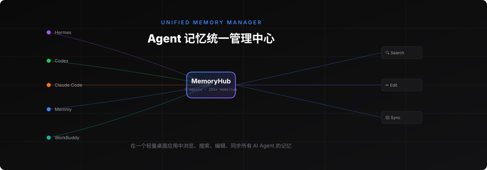
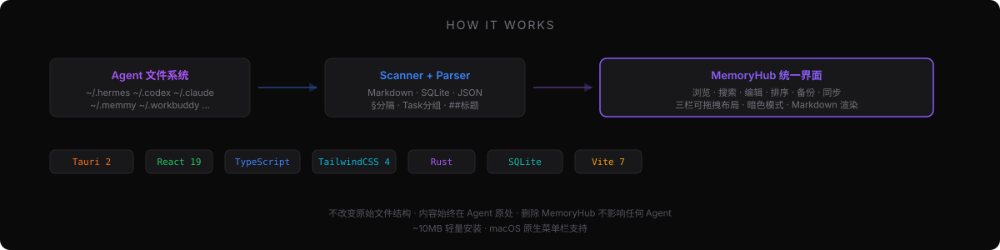

<p align="center">
  
</p>

<p align="center">
  <strong>在一个轻量桌面应用中浏览、搜索、编辑、同步所有 AI Agent 的记忆</strong>
</p>

<p align="center">
  <a href="https://github.com/YZhuAndrew/MemoryHub/releases/latest">
    
  </a>
  <a href="https://github.com/YZhuAndrew/MemoryHub/releases/latest">
    
  </a>
  <a href="./LICENSE">
    
  </a>
  <a href="https://github.com/YZhuAndrew/MemoryHub/commits/main">
    
  </a>
</p>

<p align="center">
  <a href="#-下载安装">下载安装</a> ·
  <a href="#-支持的-agent">支持的 Agent</a> ·
  <a href="#-功能特性">功能特性</a> ·
  <a href="#-技术栈">技术栈</a> ·
  <a href="#-更新日志">更新日志</a>
</p>

---

## 💡 这是什么

MemoryHub 是一个轻量级 macOS 桌面工具，解决一个简单的问题：**你的 AI Agent 太多了，记忆散落在各处**。

Hermes 用 `§` 分隔的记忆、Codex 用 Task 分组、Memmy 存在 SQLite 数据库、WorkBuddy 用 `##` 标题、Claude Code 的 CLAUDE.md、千问办公的 awareness 套件……每个 Agent 有自己的格式和位置。MemoryHub 把它们全部扫描进来，在一个统一的三栏界面里管理。

> 核心原则：MemoryHub 是一个**索引器 + 编辑器**。它不改变原始文件结构，内容始终在 Agent 原处。删除 MemoryHub 不影响任何 Agent。

## 📥 下载安装

### 方式一：直接下载（推荐）

前往 [Releases 页面](https://github.com/YZhuAndrew/MemoryHub/releases/latest) 下载 `MemoryHub_x.x.x_aarch64.dmg`：

1. 双击打开 `.dmg`
2. 将 MemoryHub 拖入「应用程序」文件夹
3. 首次打开：**右键 → 打开**（绕过 Gatekeeper，因为应用未做 Apple 开发者签名）

> ⚠️ 当前仅提供 **macOS Apple Silicon（M1/M2/M3/M4）** 原生安装包（约 4 MB）。Intel Mac 用户请用下面的「从源码构建」。

### 方式二：从源码构建

```bash
# 前置要求：Node.js 18+、Rust（含 cargo）、Xcode Command Line Tools
pnpm install
pnpm tauri dev      # 开发模式
pnpm tauri build    # 构建发布包（产物在 src-tauri/target/release/bundle/）
```

<details>
<summary>国内用户 Rust 镜像加速</summary>

如果 cargo 下载慢，配置 `~/.cargo/config.toml`：

```toml
[source.crates-io]
replace-with = "rsproxy-sparse"

[source.rsproxy-sparse]
registry = "sparse+https://rsproxy.cn/index/"
```

</details>

## 🤖 支持的 Agent

内置 **16 个**常见 Agent，开箱即用：

| Agent | 格式 | 关键路径 |
|-------|------|---------|
| **Hermes** | `§` 分隔的 Markdown | `~/.hermes/memories/MEMORY.md` |
| **Codex** | Task 分组 + rules/prompts 目录 | `~/.codex/` |
| **Claude Code** | CLAUDE.md + projects/*/memory/ | `~/.claude/` |
| **Claude Memory** | SQLite 数据库 | `~/.claude-mem/claude-mem.db` |
| **Memmy** | SQLite（FTS + 向量嵌入） | `~/.memmy/memory-service/memory.sqlite` |
| **WorkBuddy** | `##` 标题切分 | `~/.workbuddy/` |
| **OpenClaw** | 身份文件套件 | `~/.openclaw/workspace/` |
| **CoPaw** | 多 workspace（通配符） | `~/.copaw/workspaces/*/` |
| **ZCode** | skills 目录 | `~/.zcode/skills/` |
| **Cursor** | skills 目录 | `~/.cursor/skills/` |
| **千问办公** | awareness 套件（§ 分隔） | `~/.qwenworkcn/awareness/main/` |
| **QoderWork** | awareness 套件（§ 分隔） | `~/.qoderworkcn/awareness/main/` |
| **Trae** | 用户画像 + 规则 + 会话记忆 | `~/.trae-cn/memory/` |
| **Qoder** | skills 目录 | `~/.qoder/skills/` |
| **Opencode** | skills 目录 | `~/.opencode/skills/` |
| **pi / Orca** | skills 目录 | `~/.pi/agent/skills/` |

> 不在列表里？往下看 **[自定义 Agent](#%EF%B8%8F-自定义-agent)**，可视化添加任意 Agent。
> 也支持添加项目级记忆（如 `~/git-projects/my-project/CLAUDE.md`）。

<p align="center">
  
</p>

## ✨ 功能特性

### 浏览与搜索
- **三栏可拖拽布局** — 左侧 Agent/项目/类型导航，中间记忆列表，右侧详情编辑
- **全局搜索** — 跨所有 Agent 搜索标题、内容、标签
- **多维筛选** — 按 Agent、项目、类型组合筛选
- **三种排序** — 按时间、按类型、按标题

### 编辑与类型管理
- **编辑写回原文件** — 编辑后精确写回，不破坏原文件其他内容（`⌘S` 保存 / `Esc` 取消）
- **Markdown 渲染** — 详情面板用 react-markdown 渲染，正确处理 frontmatter
- **类型可修改** — Profile 条目类型和单条记忆类型都可在设置中覆盖
- **外部编辑器** — 一键用 Typora / Zed / VS Code / Cursor 打开，或在访达中显示

### 🛠️ 自定义 Agent
- **完整增删改查** — 在设置中添加任意 Agent，能力与内置 Agent 完全对等
- **扫描条目编辑器** — 每个条目可配置：记忆类型、相对路径、文件格式（`md-full` / `md-heading` / `md-section` / `dir-md` / `sqlite` 等）、是否可编辑
- **格式专属参数** — `md-section` 配置分隔符、`dir-md` 配置 glob/排除规则、复杂格式提供 JSON 高级选项
- **自动生效** — 保存后自动重新扫描，自定义 Agent 立即出现在侧边栏

### 🔄 更新检查
- **自动检查** — 应用启动时静默检查 GitHub 是否有新版本（失败不打扰）
- **更新提示** — 发现新版本时顶部弹蓝色横幅，显示新旧版本号与发布日期，一键跳转下载
- **手动检查** — 工具栏按钮（有新版时高亮+脉动提示）或设置内「检查更新」按钮

### 📌 菜单栏常驻
- **关闭驻留** — 点窗口关闭按钮时隐藏到菜单栏（进程保留），从 Dock 或托盘图标重新唤回；真正退出走托盘菜单的「退出 MemoryHub」
- **托盘菜单** — 右键托盘图标：显示/隐藏窗口、重新扫描、退出
- **自动刷新** — 监听 Agent 记忆文件变化，自动重新扫描（防抖，可在设置关闭）

### 个性化
- **暗色模式** — 跟随系统，一键切换，记忆偏好
- **字体大小** — `⌘+` / `⌘-` / `⌘0` 调整
- **自定义图标颜色** — 为每个 Agent 和项目选择 lucide 图标和主题色
- **专属应用图标** — 渐变背景 + 节点辐射设计，体现「记忆统一管理中心」定位

### 备份与恢复
- **一键备份** — 打包设置 + 所有记忆文件为 zip
- **版本管理** — 默认保留最近 10 个备份
- **导出/导入** — 导出到任意位置，从 zip 恢复

## 🏗️ 技术栈

| 层 | 技术 | 说明 |
|----|------|------|
| 桌面框架 | Tauri 2 | 轻量（~4MB），原生体验 |
| 前端 | React 19 + TypeScript | 三栏 UI |
| 构建 | Vite 7 + pnpm | 快速 HMR |
| 后端 | Rust | 文件系统操作、SQLite、备份压缩、菜单栏托盘、文件监听 |
| 数据库 | SQLite / rusqlite | Memmy/claude-mem 记忆读取 |
| 样式 | TailwindCSS 4 | 响应式 + 暗色模式 |
| 状态 | Zustand | 轻量全局状态管理 |
| 图标 | lucide-react | 无色 SVG 线条图标 |
| Markdown | react-markdown + remark-gfm | GFM 表格/任务列表 + frontmatter |

## 📂 项目结构

```
memoryhub/
├── src/                           # 前端 (TypeScript/React)
│   ├── types/                     # 核心类型定义
│   ├── constants/                 # 图标注册表、颜色调色板、类型映射
│   ├── core/
│   │   ├── profiles/              # Agent Profile 注册表（扫描规则）
│   │   ├── scanner/               # 扫描引擎 + Tauri/Node FsAdapter
│   │   ├── parser/                # Markdown/SQLite 解析器
│   │   ├── editor/                # 编辑写回引擎
│   │   ├── actions.ts             # 外部操作（打开/复制/访达）
│   │   ├── backup.ts              # 备份/恢复封装
│   │   └── update-checker.ts      # GitHub 更新检查
│   ├── components/                # UI 组件（三栏/弹窗/选择器）
│   ├── hooks/                     # 主题、字体大小、更新检查
│   └── store/                     # Zustand 状态管理
├── src-tauri/                     # Rust 后端
│   ├── src/lib.rs                 # Tauri 命令（fs/sqlite/backup/...）
│   ├── Cargo.toml
│   └── tauri.conf.json
└── scripts/                       # CLI 验证脚本
```

## 🔧 如何工作

MemoryHub 通过 **Agent Profile 注册表** 知道每种 Agent 把文件存在哪里、什么格式。扫描时：

1. 遍历所有启用的 Profile（内置 + 用户自定义）
2. 根据 Profile 配置找到对应的文件/目录
3. 交给对应的 Parser 解析（Markdown 多格式 / SQLite 查询）
4. 统一抽象为 `MemoryItem` 数据模型
5. 在三栏界面中展示

新增**内置** Agent 只需在 `builtin-profiles.ts` 中加一条 Profile 配置；**普通用户无需改代码**——在设置界面用「自定义 Agent」即可可视化添加任意 Agent。

## 📋 更新日志

### v0.1.2
- 📌 **菜单栏常驻** — 关闭窗口时驻留菜单栏（进程保留），从 Dock 或托盘图标重新唤回；真正退出走托盘菜单
- 🔄 **记忆变化自动刷新** — 监听 Agent 记忆文件变化，自动重新扫描（智能过滤配置/日志/轮询租约等运行时文件，避免误触发）
- 🎨 **菜单栏单色图标** — 透明背景线条版，跟随系统菜单栏亮暗自动反色
- ⚙️ **新增设置开关** — 关闭驻留 / 自动刷新均可独立开关

### v0.1.1
- 🆕 **从 GitHub 自动检查更新** — 启动时静默检查 + 工具栏按钮 + 设置内手动检查
- 🎨 **专属应用图标** — 渐变背景 + 节点辐射设计

### v0.1.0
- 🎉 首个正式版本
- 16 个内置 Agent 支持（Hermes/Codex/Claude/Memmy/千问办公/QoderWork/Trae 等）
- 三栏浏览/搜索/编辑、自定义 Agent、项目级记忆、备份恢复、暗色模式

[查看完整更新历史 →](https://github.com/YZhuAndrew/MemoryHub/releases)

## 🗺️ 开发路线

- [x] **v0.1.x** — 核心功能：扫描/浏览/搜索/编辑/设置/备份/自定义 Agent/更新检查
- [x] 菜单栏 Tray 常驻（关闭驻留 + 文件变化自动刷新）
- [ ] 跨 Agent 同步（格式转换 + 预览）
- [ ] 更多 Agent 适配（Gemini CLI、Aider 等）

## 📄 License

[MIT](./LICENSE)
